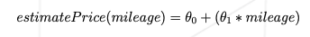
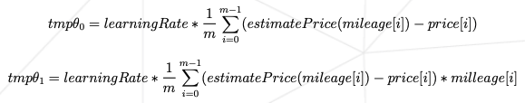

# Linear Regression

A Codam project where a LinearRegression model using gradient descent must be trained on a small dataset containing the correlation between km driven and car prices.

When training the model theta0 and theta1 will be calculated and saved in a file for the predict.py program to use later.

Formula used to predict price:



Formula used for gradient descent:




## Installation

Use the package manager [pip](https://pip.pypa.io/en/stable/) to install the requirements.

```bash
pip install -r requirements.txt
```

## Usage
#### Train LinearRegression model
```bash
python3 app/train.py [-h] [-v] app/data/data.csv

positional arguments:
  data             path to dataset

optional arguments:
  -h, --help       show this help message and exit
  -v, --visualize  visualize dataset and regression
```

#### Predict mileage using LinearRegression model
```bash
python3 app/predict.py [-h] [-f]

optional arguments:
  -h, --help    show this help message and exit
  -f , --file   path to file with stored theta
```
